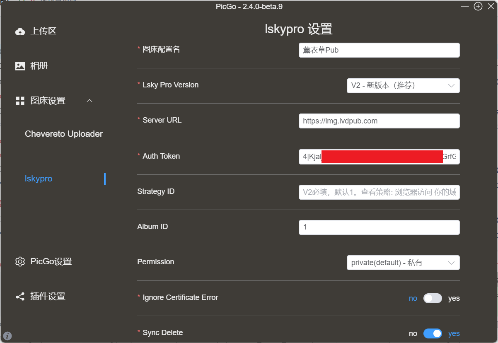

# picgo-plugin-lskypro-own

[](https://www.npmjs.com/package/picgo-plugin-lskypro-own)
[](https://npmcharts.com/compare/picgo-plugin-lskypro-own?minimal=true)
[](https://github.com/lemodragon/Picgo-Plugin-Lskypro/blob/main/LICENSE)

**兰空图床(Lsky Pro+)上传插件——支持V1和V2(付费用户)**

[兰空图床 (Lsky Pro)](https://github.com/lsky-org/lsky-pro) 的 PicGo 上传插件，支持 V1 和 V2 版本。

> Lsky Pro 是一个用于在线上传、管理图片的图床程序，中文名：兰空图床。你可以将它作为自己的云上相册，亦可以当作你的写作贴图库。

## ✨ 特性

- ✅ 支持兰空图床 V1 和 V2 版本
- ✅ **Token 自动处理** - 无需手动添加 Bearer 前缀
- ✅ **智能默认配置** - Strategy ID 默认为 1，开箱即用
- ✅ 支持自定义存储策略
- ✅ 支持相册分类（V2）
- ✅ 支持图片权限设置（公开/私有）
- ✅ 支持同步删除功能（V2）
- ✅ 支持忽略证书错误
- ✅ 配置界面友好，提示清晰

## 📦 安装

### 方法 1：在线安装（推荐）

1. 打开 PicGo 详细窗口
2. 选择 **插件设置**
3. 搜索 **lskypro-own**
4. 点击安装
5. 重启 PicGo

### 方法 2：命令行安装

```bash
# 进入 PicGo 配置目录
# Windows: %APPDATA%\picgo
# Linux: ~/.config/picgo
# macOS: ~/Library/Application Support/picgo

# 安装插件
npm install picgo-plugin-lskypro-own

# 重启 PicGo
```

## 📖 使用教程

安装完成后，按照以下步骤配置和使用插件：



## 🔧 配置说明

安装完成后，在 PicGo 的图床设置中选择 **Lsky Pro**，然后配置以下参数：

### 配置项

| 配置项 | 说明 | 必填 | 默认值 |
|--------|------|------|--------|
| **Lsky Pro Version** | 选择图床版本（V1 或 V2） | ✅ | V2 |
| **Server URL** | 图床服务器地址 | ✅ | - |
| **Auth Token** | 认证 Token（无需 Bearer 前缀） | ✅ | - |
| **Strategy ID** | 存储策略 ID（V2 必填） | ❌ | 1 |
| **Album ID** | 相册 ID（仅 V2） | ❌ | - |
| **Permission** | 图片权限（公开/私有） | ❌ | 私有 |
| **Sync Delete** | 同步删除（仅 V2） | ❌ | 关闭 |
| **Ignore Certificate Error** | 忽略证书错误 | ❌ | 关闭 |

### 快速配置示例

```yaml
Lsky Pro Version: V2
Server URL: https://img.example.com
Auth Token: 1|xxxxxxxxxxxxxxxxxxxxxxxxxxxxxx
Strategy ID: 1
Permission: public
```

### 重要提示

#### 1. Server URL
- ✅ 正确：`https://img.example.com`
- ❌ 错误：`https://img.example.com/`（不要以 `/` 结尾）

#### 2. Auth Token（重要！）
- **直接粘贴 Token 即可，无需手动添加 `Bearer` 前缀**
- 插件会自动处理 Token 格式
- 例如：直接填写 `1|xxxxxx`，插件会自动转换为 `Bearer 1|xxxxxx`

#### 3. Strategy ID
- **V2 版本必填**，默认值为 `1`
- 大多数情况下使用默认值即可
- 如需使用其他存储策略，请参考下方"获取 Strategy ID"部分

## 🔑 获取 Token

### V1 版本

1. 登录兰空图床
2. 进入 **个人设置** 页面
3. 复制 **API Token**
4. 在 PicGo 中直接粘贴（无需添加 Bearer）

### V2 版本

#### 方法 1：使用 cURL

```bash
curl --location --request POST 'https://your.domain/api/v1/tokens' \
--form 'email="your_email@example.com"' \
--form 'password="your_password"'
```

#### 方法 2：使用 Postman 等工具

1. 请求方法：`POST`
2. 请求 URL：`https://your.domain/api/v1/tokens`
3. 请求头：`Accept: application/json`
4. 请求体（form-data）：
   - `email`: 你的邮箱
   - `password`: 你的密码

响应示例：
```json
{
  "status": true,
  "message": "success",
  "data": {
    "token": "1|xxxxxxxxxxxxxxxxxxxxxxxxxxxxxx"
  }
}
```

在 PicGo 中直接粘贴 Token 即可（例如：`1|xxxxxxxxxxxxxxxxxxxxxxxxxxxxxx`）

## 📋 获取 Strategy ID

### 方法 1：浏览器访问（推荐）

1. 在浏览器中访问：`https://你的域名/api/v1/strategies`
2. 登录后会显示可用的存储策略 JSON 数据
3. 找到 `"id"` 字段对应的数值

### 方法 2：使用 API

```bash
curl -X GET 'https://你的域名/api/v1/strategies' \
  -H 'Accept: application/json' \
  -H 'Authorization: Bearer {你的Token}'
```

响应示例：
```json
{
  "status": true,
  "message": "success",
  "data": {
    "strategies": [
      {"id": 1, "name": "本地储存"},
      {"id": 2, "name": "阿里云 OSS"}
    ]
  }
}
```

## 📖 使用方法

### 上传图片

1. 配置完成后，在 PicGo 上传区选择 **Lsky Pro** 作为图床
2. 拖拽图片或点击上传
3. 上传成功后会自动复制图片链接

### 删除图片（V2）

1. 确保已开启 **Sync Delete** 选项
2. 在 PicGo 相册中找到要删除的图片
3. 右键选择删除
4. 图床上的文件会同步删除（可能需要几分钟生效）

## 🔍 常见问题

### 1. 上传失败：服务异常

**原因**：V2 版本未填写 Strategy ID 或策略 ID 不存在

**解决方案**：
- 确认 Strategy ID 已填写（默认为 `1`）
- 通过上述方法查看可用的策略列表
- 确保填写的 Strategy ID 存在于你的账号中

### 2. Token 认证失败

**原因**：Token 格式错误或已过期

**解决方案**：
- 确认直接粘贴了原始 Token（不要手动添加 Bearer）
- 重新生成 Token 并更新配置
- 确认 Token 未过期

### 3. 删除图片后仍然可以访问

**原因**：CDN 缓存或删除操作延迟

**解决方案**：
- 删除操作可能需要 2-5 分钟生效
- 图片 URL 可能因 CDN 缓存仍可访问（通常 24 小时后过期）
- 建议在图床管理后台确认删除结果

### 4. 证书错误：certificate has expired

**原因**：使用了过期的 SSL 证书

**解决方案**：
- 开启 **Ignore Certificate Error** 选项
- 或联系图床管理员更新证书

## 📚 API 文档

完整的 API 文档请参考：[Lsky Pro API 文档](https://lsky-pro.apifox.cn/api-195702140)

### 主要接口

| 接口 | 方法 | 路径 | 说明 |
|------|------|------|------|
| 上传图片 | POST | `/api/v1/upload` | 上传图片到图床 |
| 删除图片 | DELETE | `/api/v1/images/{key}` | 删除指定图片 |
| 图片列表 | GET | `/api/v1/images` | 获取图片列表 |
| 用户信息 | GET | `/api/v1/profile` | 获取用户信息 |
| 存储策略 | GET | `/api/v1/strategies` | 获取存储策略列表 |

## 🛠️ 开发

### 环境要求

- Node.js >= 12.0.0
- npm >= 6.0.0

### 本地开发

```bash
# 克隆项目
git clone https://github.com/lemodragon/Picgo-Plugin-Lskypro.git
cd Picgo-Plugin-Lskypro

# 安装依赖
npm install

# 开发模式（监听文件变化）
npm run dev

# 编译
npm run build

# 在 PicGo 中测试
# 进入 PicGo 配置目录，执行：
npm install /path/to/picgo-plugin-lskypro
```

### 项目结构

```
picgo-plugin-lskypro/
├── src/
│   ├── index.ts           # 主入口文件
│   └── lib/
│       └── interface.ts   # 类型定义
├── dist/                  # 编译输出目录
├── logo.png              # 插件图标
├── package.json          # 项目配置
├── tsconfig.json         # TypeScript 配置
├── README.md             # 说明文档
├── changelog.md          # 版本日志
└── LICENSE               # 开源协议
```

## 📝 更新日志

查看 [changelog.md](./changelog.md) 了解版本更新历史。

### v1.0.0 (2026-02-27)

#### 新特性
- ✅ 支持兰空图床 V1 和 V2 版本
- ✅ **Token 自动处理**：无需手动添加 Bearer 前缀
- ✅ **Strategy ID 智能默认值**：默认为 1，开箱即用
- ✅ **配置界面优化**：所有字段都有清晰的中文说明
- ✅ 支持自定义存储策略
- ✅ 支持相册分类（V2）
- ✅ 支持图片权限设置
- ✅ 支持同步删除功能（V2）

#### 改进
- 修复上传失败问题：自动设置默认 strategy_id
- 优化删除提示信息，说明删除操作可能存在延迟
- 精简配置提示文字，确保在界面中完整显示

## 💖 赞助支持

如果这个项目对你有帮助，欢迎通过爱发电支持我：

<div align="center">
  
</div>

你的支持是我持续维护和改进项目的动力！

## 🤝 贡献

欢迎提交 Issue 和 Pull Request！

1. Fork 本项目
2. 创建特性分支 (`git checkout -b feature/AmazingFeature`)
3. 提交更改 (`git commit -m 'Add some AmazingFeature'`)
4. 推送到分支 (`git push origin feature/AmazingFeature`)
5. 提交 Pull Request

## 📄 开源协议

本项目采用 [MIT](./LICENSE) 协议开源。

## 🙏 致谢

- [PicGo](https://github.com/Molunerfinn/PicGo) - 优秀的图床管理工具
- [Lsky Pro](https://github.com/lsky-org/lsky-pro) - 强大的图床程序
- 原项目 [picgo-plugin-lankong](https://github.com/hellodk34/picgo-plugin-lankong) 提供的基础代码

## 📮 联系方式

- 提交 Issue：[GitHub Issues](https://github.com/lemodragon/Picgo-Plugin-Lskypro/issues)
- GitHub：[@lemodragon](https://github.com/lemodragon)

---

如果觉得项目有用，欢迎点个 ⭐️ Star 支持一下！
